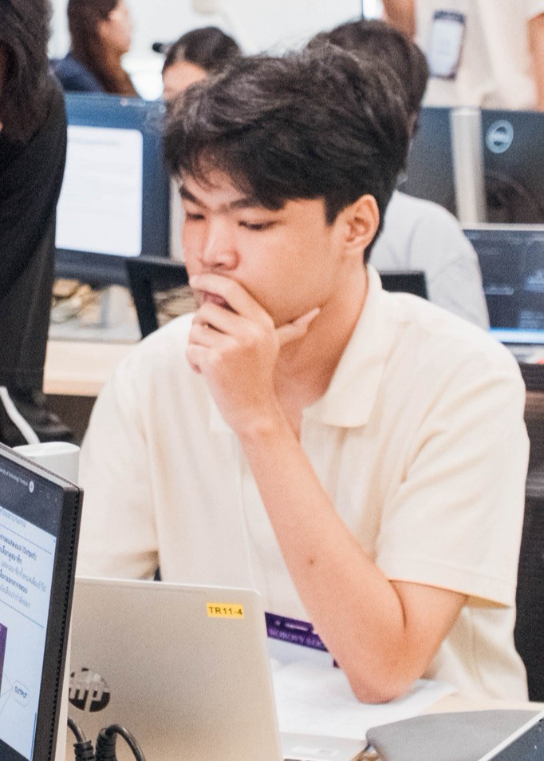
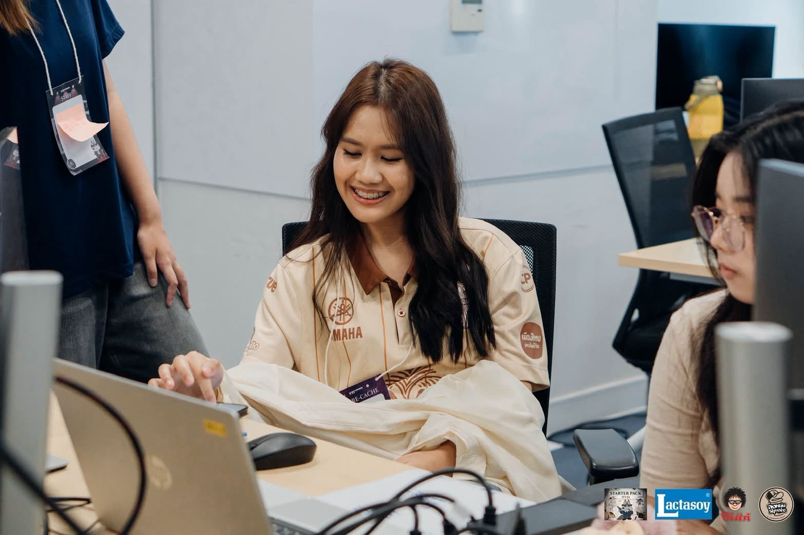
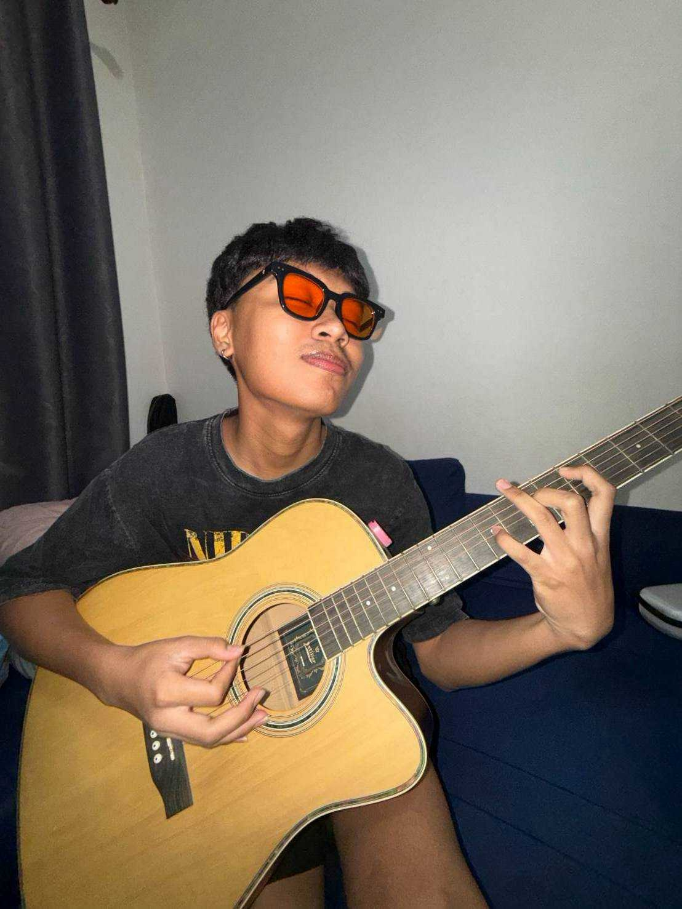

<h1 align = "center">ข้อมูลพื้นฐาน</h1> 
 

 
 

<h2>ลิงก์ social media </h2> IG : rmx_usef ( https://www.instagram.com/rmx_usef?igsh=MTAxc2M3MGZpbmRhaA%3D%3D&utm_source=qr )  

<h2>ประวัติส่วนตัว</h2> 
ชื่อ : นายชิดพงษ์ รื่นรมย์  
ชื่อเล่น : เซฟ  
อายุ : 19  

<h2>อนาคตอยากทำอะไร ?</h2> 
Answer : Full-stack dev เป็นความฝันสูงสุด  

<h2>แนวเพลงที่ชอบ ?</h2> 
Question : ชอบฟังเพลงแนวอะไร เพราะอะไรจึงชอบฟังเพลงแนวนี้?   
Answer : Bedroom Pop / T-pop / Pop เพราะว่าชิว ฟังเพลิน ชอบฟังตอนไม่ได้ทำอะไรก็รู้สึกสนุกพอได้ฟัง  

<h2>สถานที่ที่ชอบ ?</h2> 
Question : สถานที่ที่ชอบที่สุด 
มีความทรงจำหรือเหตุการณ์อะไรที่ทำให้ชอบสถานที่นี้ ?  
Answer : ทะเล เพราะพ่อชอบพาไปบ่อยๆตอนเป็นเด็ก และชอบนั่งเฉยๆที่หาดรู้สึกผ่อนคลายได้ดี  

<h2>งานอดิเรก ?</h2>
Question : งานอดิเรกที่ชอบทำ อะไรที่ทำให้คุณสนใจงานอดิเรกนี้?   Answer : พิธีกร เพราะชอบพูดชอบย้ำเสียงของตัวเอง และก็อยากเก่งขึ้นเรื่อยๆเผื่อเป็นอาชีพรองในอนาคต  

<h2>ธรรมชาติหรือเมือง ?</h2>
Question : ระหว่างธรรมชาติ กับ ในเมืองชอบที่ไหนมากกว่า มีประสบการณ์อะไรที่ทำให้คุณรู้สึกว่าสถานที่แบบนั้นเหมาะกับคุณ?   Answer : ในเมือง ในด้านการใช้ชีวิต โดยส่วยตัวเราเป็นคนเบื่อง่าย เมืองมีหลายๆอย่างให้เลือก เช่นอาหาร แต่สุดท้ายก็สู้บ้านเกิดไม่ได้  

<h2>การทำงาน ?</h2>
Question : นอกจากเรียนมีทำงานพิเศษอะไร ไหมหรือหารายได้ระหว่างเรียน    อะไรเป็นเหตุผลที่ทำให้คุณเลือกทำงานหรือหารายได้ระหว่างเรียน?  
Answer : ไม่มี เพราะที่บ้านอยากให้ตั้งใจเรียนไม่อยากให้มีภาระ

<h2>ผู้สัมภาษณ์ </h2>
นาย ชลนที เทศงามถ้วน  
Student id : 69130500010
IG : parto4mylife  

# ข้อมูลพื้นฐาน

- **ชื่อ** : นางสาวพิมพ์พิกา ชาติราษี
- **IG** : [qimbuike](https://www.instagram.com/qimbuike?igsh=bzhrZDZmYTYwN2Np&utm_source=qr)
- **ชื่อเล่น** : ต้นหลิว
- **อายุ** : 19
- **อนาคตอยากทำอะไร** : Frond-end dev เพราะว่าชอบทำเกี่ยวกับออกแบบหน้าบ้านของเว็บ แล้วก็ชอบพวก Ux/Ui ร่วมด้วย
- **ชอบฟังเพลงแนวอะไร เพราะอะไรจึงชอบฟังเพลงแนวนี้** : แนวเพื่อชีวิต เช่น คาราบาว เสกโลโซ เพราะว่ามันทัชใจ แล้วก็เบื่อแนวเพลงสากลแล้ว เมื่อก่อนชอบ The weekend,Joji แต่ตอนนี้เปลี่ยนมาเป็นคาราบาว
- **สถานที่ที่ชอบที่สุด มีความทรงจำหรือเหตุการณ์อะไรที่ทำให้ชอบสถานที่นี้** : ชอบบ้านตัวเองที่ต่างจังหวัด(สุโขทัย) เพราะคิดถึงบรรยากาศชนบท คิดถึงคุณยาย คุณตา โตที่นั่น มีความทรงจำเยอะ
- **งานอดิเรกที่ชอบทำ อะไรที่ทำให้คุณสนใจงานอดิเรกนี้** : ติดสติ๊กเกอร์ เพราะเวลาว่างๆเหงาๆ หรือทำอะไรเครียดๆมา นั่งติดสติ๊กเกอร์น่ารักๆกับของที่เราใช่ทุกวัน ความเครียดนั้นก็หายไป
- **ระหว่างธรรมชาติ กับ ในเมืองชอบที่ไหนมากกว่า มีประสบการณ์อะไรที่ทำให้คุณรู้สึกว่าสถานที่แบบนั้นเหมาะกับคุณ** : ชอบธรรมชาติมากกว่า เพราะว่าเคยไปต่างจังหวัดหลายๆที่มา รู้สึกว่ามันสงบ เป็นคนชอบต้นไม้อยู่แล้วด้วย เห็นต้นไม้ภูเขาแม่น้ำลำธารแล้วมันสบายใจ
- **นอกจากเรียนมีทำงานพิเศษอะไร ไหมหรือหารายได้ระหว่างเรียน อะไรเป็นเหตุผลที่ทำให้คุณเลือกทำงานหรือหารายได้ระหว่างเรียน** : มีทำงานพิเศษด้วย ที่ทำตอนนี้ก็มีเปิดร้านรับทำการบ้าน แต่เราเป็นคนกลาง คุยระหว่างลูกค้า กับคนทำ แล้วก็ขายอาหารผ่าน lineman ที่ทำเพราะรู้สึกมันว่างเกินไป เวลาที่เสียไป ได้เงินมาก็คงดี แล้วก็อยากซื้อของที่อยากได้ด้วยเงินตัวเอง คือมันสามารถซื้อได้เลยโดยไม่ต้องขอพ่อแม่ แล้วก็ภูมิใจด้วย

### ผู้สัมภาษณ์

- นางสาวธวัลรัตน์ สิทธิบวรสกุล
- **รหัสนักสึกษา**: 69130500024

---

- **Instagram:** [rosesainaxcr._](https://www.instagram.com/rosesainaxcr._?igsh=NGV4ZTBtNWVvbndr&utm_source=ig_contact_invite)
- **ชื่อ:** ณัฐชุดา ผันอากาศ
- **ชื่อเล่น:** หมี่กรอบ
- **อายุ:** 18 ปี
- **อนาคตที่อยากเป็น:** ใช้ชีวิตอย่างมีความสุขและมีสุขภาพดี

- **ชอบฟังเพลงแนวอะไร เพราะอะไรจึงชอบฟังเพลงแนวนี้? :**
  เพลงแนว classic ยุค 90's เพราะฟังแล้วคิดถึงบรรยากาศเก่าๆ

- **สถานที่ที่ชอบที่สุด มีความทรงจำหรือเหตุการณ์อะไรที่ทำให้ชอบสถานที่นี้? :**
  รีสอร์ทส่วนตัวของเพื่อน เป็นสถานที่ที่ได้รวมกลุ่มเพื่อนม.ปลายครั้งสุดท้าย

- **งานอดิเรกที่ชอบทำ อะไรที่ทำให้คุณสนใจงานอดิเรกนี้? :**
  ฟังเพลงและเล่นเกม เพราะเป็นงานอดิเรกที่ช่วยคลายเครียดได้ดี

- **ระหว่างธรรมชาติกับในเมือง ชอบที่ไหนมากกว่า มีประสบการณ์อะไรที่ทำให้คุณรู้สึกว่าสถานที่แบบนั้นเหมาะกับคุณ? :**
  ธรรมชาติ ระหว่างเดินทางกลับต่างจังหวัดได้เห็นวิวข้างทางที่เต็มไปด้วยภูเขาและต้นไม้แล้วรู้สึกผ่อนคลายมาก

- **นอกจากเรียนมีทำงานพิเศษอะไรไหม หรือหารายได้ระหว่างเรียน อะไรเป็นเหตุผลที่ทำให้คุณเลือกทำงานหรือหารายได้ระหว่างเรียน? :**
  ทำพาร์ทไทม์ช่วงปิดเทอม เพื่อสะสมเงินเก็บไว้ใช้ตอนเปิดเทอม

### ผู้สัมภาษณ์

- **ผู้สัมภาษณ์:** ญาณวุฒิ แก้วสายคุ้ม
- **รหัสนักศึกษา:** 69130500014

---

- **ลิงก์ social media** : [parto4mylife](https://www.instagram.com/parto4mylife?igsh=MWF2bms2Ymwzcmtzaw==&igsi=MWF2bms2Ymwzcmtzaw==)
- **ชื่อ** : ชลนที เทศงามถ้วน
- **ชื่อเล่น** : บารอส
- **อายุ** : 19
- **อนาคตอยากทำอะไร** : อยากเป็น Web design/Web Developer 

- **ชอบฟังเพลงแนวอะไร เพราะอะไรจึงชอบฟังเพลงแนวนี้?**
  ชอบฟังแนว Rock เพราะว่า การฟังเพลงแนว ร็อค มันทำให้เรารู้สึกหึกเหิมและสนุกไปกับมันเวลารู้สึกเบื่อและเวลาเล่นกีต้าร์ก็ชอบเล่นแนวร็อคอยู่แล้วด้วยเพราะมันสนุก

- **สถานที่ที่ชอบที่สุด มีความทรงจำหรือเหตุการณ์อะไรที่ทำให้ชอบสถานที่นี้?**
  สถานที่ที่ชอบที่สุดของบ้าน ตอนนี้มาเรียนอยู่กรุงเทพ ซึ่งมันไกลจากบ้านมากๆมันทำให้คิดถึงบ้านเพราะคนที่บ้านมอบความอบอุ่นและความรัก

- **งานอดิเรกที่ชอบทำ อะไรที่ทำให้คุณสนใจงานอดิเรกนี้?**
  การเล่นกีต้าร์เพราะว่าชอบฟัง Bodyslam อยากเป็นแบบพี่ยอด (มือกีต้าร์ของวง) สำคัญคืออยากเล่นไปจีบสาว

- **ระหว่างธรรมชาติ กับ ในเมืองชอบที่ไหนมากกว่า มีประสบการณ์อะไรที่ทำให้คุณรู้สึกว่าสถานที่แบบนั้นเหมาะกับคุณ?**
  ชอบอยู่ในเมืองมากกว่า เพราะเราชอบอยู่ในที่ที่มีแสงสีเสียงไม่ทำให้รู้สึกเหงาเปล่าเปลี่ยวแถมยังมีเพื่อนๆที่พาไปเที่ยวหรือไปทำอะไรที่ไม่ทำให้เบื่ออีกด้วย

- **นอกจากเรียนมีทำงานพิเศษอะไร ไหมหรือหารายได้ระหว่างเรียน อะไรเป็นเหตุผลที่ทำให้คุณเลือกทำงานหรือหารายได้ระหว่างเรียน?**
  ส่วนตัวตอนนี้เยังไม่มีงานอะไรทำแต่ก็มีแพลนว่าอยากทำงานพาร์ทไทม์หรือฟรีแลนซ์อยู่เพราะอยากแบ่งเบาภาระครอบครัวและหาประสบการณ์ใหม่ๆ
  
### ผู้สัมภาษณ์
- **ผู้สัมภาษณ์**: นายชิดพงษ์ รื่นรมย์
- **รหัสนักศึกษา**: 69130500012
---
