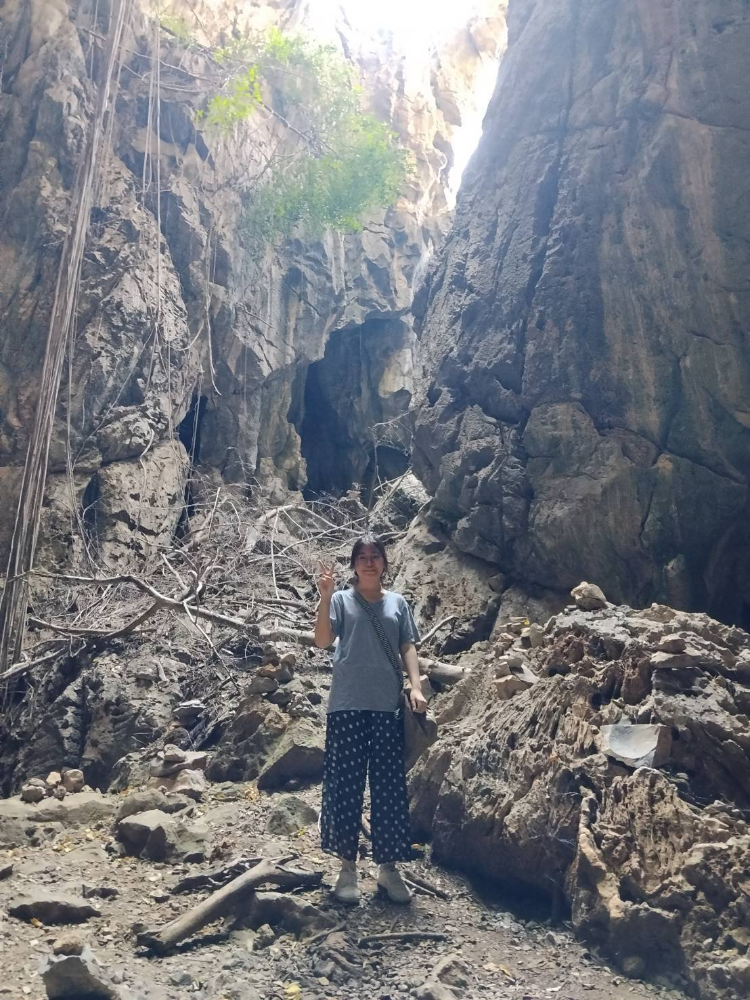

# Joining Forces - ร่วมด้วยช่วยกัน

## นายชิดพงษ์ รื่นรมย์ (เซฟ)

### ข้อมูลพื้นฐาน

- **ชื่อ:** นายชิดพงษ์ รื่นรมย์
- **ชื่อเล่น:** เซฟ
- **อายุ:** 19 ปี
- **Instagram:** [rmx_usef](https://www.instagram.com/rmx_usef?igsh=MTAxc2M3MGZpbmRhaA%3D%3D&utm_source=qr)

### อนาคตอยากทำอะไร

Full-stack dev เป็นความฝันสูงสุด

### ชอบฟังเพลงแนวอะไร เพราะอะไรจึงชอบฟังเพลงแนวนี้

Bedroom Pop / T-pop / Pop เพราะว่าชิว ฟังเพลิน ชอบฟังตอนไม่ได้ทำอะไรก็รู้สึกสนุกพอได้ฟัง

### สถานที่ที่ชอบที่สุด มีความทรงจำหรือเหตุการณ์อะไรที่ทำให้ชอบสถานที่นี้

ทะเล เพราะพ่อชอบพาไปบ่อยๆตอนเป็นเด็ก และชอบนั่งเฉยๆที่หาดรู้สึกผ่อนคลายได้ดี

### งานอดิเรกที่ชอบทำ อะไรที่ทำให้คุณสนใจงานอดิเรกนี้?:

 พิธีกร เพราะชอบพูดชอบย้ำเสียงของตัวเอง และก็อยากเก่งขึ้นเรื่อยๆเผื่อเป็นอาชีพรองในอนาคต

### ระหว่างธรรมชาติ กับ ในเมืองชอบที่ไหนมากกว่า มีประสบการณ์อะไรที่ทำให้คุณรู้สึกว่าสถานที่แบบนั้นเหมาะกับคุณ?: 

ในเมือง ในด้านการใช้ชีวิต โดยส่วยตัวเราเป็นคนเบื่อง่าย เมืองมีหลายๆอย่างให้เลือก เช่นอาหาร แต่สุดท้ายก็สู้บ้านเกิดไม่ได้

### นอกจากเรียนมีทำงานพิเศษอะไร ไหมหรือหารายได้ระหว่างเรียน     อะไรเป็นเหตุผลที่ทำให้คุณเลือกทำงานหรือหารายได้ระหว่างเรียน?: 

ไม่มี เพราะที่บ้านอยากให้ตั้งใจเรียนไม่อยากให้มีภาระ
### ผู้สัมภาษณ์

- **ชื่อ:** ชลนที เทศงามถ้วน
- **รหัสนักศึกษา:** 69130500010
---

## ญาณวุฒิ แก้วสายคุ้ม (เพลง)

### ข้อมูลพื้นฐาน

- **ชื่อ:** ญาณวุฒิ แก้วสายคุ้ม
- **ชื่อเล่น:** เพลง
- **อายุ:** 18 ปี
- **Instagram:** [thsensei_official](https://www.instagram.com/thsensei_official?igsh=MW5wNHoyYWt4bDJpcQ%3D%3D&utm_source=qr)

### อนาคตอยากทำอะไร

อยากเป็นคนที่ใช้จ่ายแบบไม่กังวลเรื่องเงิน

### ชอบฟังเพลงแนวอะไร เพราะอะไรจึงชอบฟังเพลงแนวนี้

เพื่อชีวิต เพราะเป็นเพลงที่ฟังแล้วสบายๆทำให้ความเครียดลดลงได้

### สถานที่ที่ชอบที่สุด มีความทรงจำหรือเหตุการณ์อะไรที่ทำให้ชอบสถานที่นี้

ป่า เพราะเป็นหนึ่งในสถานที่ท่องเที่ยวที่ผมชอบไปเวลาผมเครียดเรื่องงานหรือเรื่องอื่นๆ

### งานอดิเรกที่ชอบทำ อะไรที่ทำให้คุณสนใจงานอดิเรกนี้

เล่นกีฬา เพราะสนุกและทำให้ร่างกายแข็งแรง

### ระหว่างธรรมชาติ กับ ในเมืองชอบที่ไหนมากกว่า มีประสบการณ์อะไรที่ทำให้คุณรู้สึกว่าสถานที่แบบนั้นเหมาะกับคุณ

ธรรมชาติ เพราะธรรมชาติฝุ่นน้อยกว่าในเมือง

### นอกจากเรียนมีทำงานพิเศษอะไร ไหมหรือหารายได้ระหว่างเรียน อะไรเป็นเหตุผลที่ทำให้คุณเลือกทำงานหรือหารายได้ระหว่างเรียน

Freelance เพราะว่าเวลาไปเที่ยวผมจะได้ใช้เงินตัวเองไม่ใช่จากเงินที่แม่ให้

### ผู้สัมภาษณ์

- **ชื่อ:** นางสาวณัฐชุดา ผันอากาศ
- **รหัสนักศึกษา:** 69130500018

---

## ณัฐชุดา ผันอากาศ (หมี่กรอบ)

### ข้อมูลพื้นฐาน

- **ชื่อ:** ณัฐชุดา ผันอากาศ
- **ชื่อเล่น:** หมี่กรอบ
- **อายุ:** 18 ปี
- **Instagram:** [rosesainaxcr._](https://www.instagram.com/rosesainaxcr._?igsh=NGV4ZTBtNWVvbndr&utm_source=ig_contact_invite)

### อนาคตที่อยากเป็น

ใช้ชีวิตอย่างมีความสุขและมีสุขภาพดี

### ชอบฟังเพลงแนวอะไร เพราะอะไรจึงชอบฟังเพลงแนวนี้

เพลงแนว Classic ยุค 90's เพราะฟังแล้วคิดถึงบรรยากาศเก่าๆ

### สถานที่ที่ชอบที่สุด มีความทรงจำหรือเหตุการณ์อะไรที่ทำให้ชอบสถานที่นี้

รีสอร์ทส่วนตัวของเพื่อน เป็นสถานที่ที่ได้รวมกลุ่มเพื่อนม.ปลายครั้งสุดท้าย

### งานอดิเรกที่ชอบทำ อะไรที่ทำให้คุณสนใจงานอดิเรกนี้

ฟังเพลงและเล่นเกม เพราะเป็นงานอดิเรกที่ช่วยคลายเครียดได้ดี

### ระหว่างธรรมชาติกับในเมือง ชอบที่ไหนมากกว่า มีประสบการณ์อะไรที่ทำให้คุณรู้สึกว่าสถานที่แบบนั้นเหมาะกับคุณ

ธรรมชาติ ระหว่างเดินทางกลับต่างจังหวัดได้เห็นวิวข้างทางที่เต็มไปด้วยภูเขาและต้นไม้แล้วรู้สึกผ่อนคลายมาก

### นอกจากเรียนมีทำงานพิเศษอะไรไหม หรือหารายได้ระหว่างเรียน อะไรเป็นเหตุผลที่ทำให้คุณเลือกทำงานหรือหารายได้ระหว่างเรียน

ทำพาร์ทไทม์ช่วงปิดเทอม เพื่อสะสมเงินเก็บไว้ใช้ตอนเปิดเทอม

### ผู้สัมภาษณ์

- **ชื่อ:** ญาณวุฒิ แก้วสายคุ้ม
- **รหัสนักศึกษา:** 69130500014

---

## นางสาวพิมพ์พิกา ชาติราษี (ต้นหลิว)

### ข้อมูลพื้นฐาน

- **ชื่อ:** นางสาวพิมพ์พิกา ชาติราษี
- **ชื่อเล่น:** ต้นหลิว
- **อายุ:** 19 ปี
- **Instagram:** [qimbuike](https://www.instagram.com/qimbuike?igsh=bzhrZDZmYTYwN2Np&utm_source=qr)

### อนาคตอยากทำอะไร

Front-end dev เพราะว่าชอบทำเกี่ยวกับออกแบบหน้าบ้านของเว็บ แล้วก็ชอบพวก UX/UI ร่วมด้วย

### ชอบฟังเพลงแนวอะไร เพราะอะไรจึงชอบฟังเพลงแนวนี้

แนวเพื่อชีวิต เช่น คาราบาว เสกโลโซ เพราะว่ามันทัชใจ แล้วก็เบื่อแนวเพลงสากลแล้ว เมื่อก่อนชอบ The Weeknd, Joji แต่ตอนนี้เปลี่ยนมาเป็นคาราบาว

### สถานที่ที่ชอบที่สุด มีความทรงจำหรือเหตุการณ์อะไรที่ทำให้ชอบสถานที่นี้

ชอบบ้านตัวเองที่ต่างจังหวัด (สุโขทัย) เพราะคิดถึงบรรยากาศชนบท คิดถึงคุณยาย คุณตา โตที่นั่น มีความทรงจำเยอะ

### งานอดิเรกที่ชอบทำ อะไรที่ทำให้คุณสนใจงานอดิเรกนี้

ติดสติ๊กเกอร์ เพราะเวลาว่างๆเหงาๆ หรือทำอะไรเครียดๆมา นั่งติดสติ๊กเกอร์น่ารักๆกับของที่เราใช้ทุกวัน ความเครียดนั้นก็หายไป

### ระหว่างธรรมชาติ กับ ในเมืองชอบที่ไหนมากกว่า มีประสบการณ์อะไรที่ทำให้คุณรู้สึกว่าสถานที่แบบนั้นเหมาะกับคุณ

ชอบธรรมชาติมากกว่า เพราะว่าเคยไปต่างจังหวัดหลายๆที่มา รู้สึกว่ามันสงบ เป็นคนชอบต้นไม้อยู่แล้วด้วย เห็นต้นไม้ภูเขาแม่น้ำลำธารแล้วมันสบายใจ

### นอกจากเรียนมีทำงานพิเศษอะไร ไหมหรือหารายได้ระหว่างเรียน อะไรเป็นเหตุผลที่ทำให้คุณเลือกทำงานหรือหารายได้ระหว่างเรียน

มีทำงานพิเศษด้วย ที่ทำตอนนี้ก็มีเปิดร้านรับทำการบ้าน แต่เราเป็นคนกลาง คุยระหว่างลูกค้า กับคนทำ แล้วก็ขายอาหารผ่าน LineMAN ที่ทำเพราะรู้สึกมันว่างเกินไป เวลาที่เสียไป ได้เงินมาก็คงดี แล้วก็อยากซื้อของที่อยากได้ด้วยเงินตัวเอง คือมันสามารถซื้อได้เลยโดยไม่ต้องขอพ่อแม่ แล้วก็ภูมิใจด้วย

### ผู้สัมภาษณ์

- **ชื่อ:** นางสาวธวัลรัตน์ สิทธิบวรสกุล
- **รหัสนักศึกษา:** 69130500024

---

## ชลนที เทศงามถ้วน (บารอส)

### ข้อมูลพื้นฐาน

- **ชื่อ:** ชลนที เทศงามถ้วน
- **ชื่อเล่น:** บารอส
- **อายุ:** 19 ปี
- **Instagram:** [parto4mylife](https://www.instagram.com/parto4mylife?igsh=MWF2bms2Ymwzcmtzaw==&igsi=MWF2bms2Ymwzcmtzaw==)

### อนาคตอยากทำอะไร

อยากเป็น Web Design/Web Developer

### ชอบฟังเพลงแนวอะไร เพราะอะไรจึงชอบฟังเพลงแนวนี้

ชอบฟังแนว Rock เพราะว่า การฟังเพลงแนว ร็อค มันทำให้เรารู้สึกหึกเหิมและสนุกไปกับมัน เวลารู้สึกเบื่อ และเวลาเล่นกีต้าร์ก็ชอบเล่นแนวร็อคอยู่แล้วด้วยเพราะมันสนุก

### สถานที่ที่ชอบที่สุด มีความทรงจำหรือเหตุการณ์อะไรที่ทำให้ชอบสถานที่นี้

สถานที่ที่ชอบที่สุดคือบ้าน ตอนนี้มาเรียนอยู่กรุงเทพ ซึ่งมันไกลจากบ้านมากๆ มันทำให้คิดถึงบ้านเพราะคนที่บ้านมอบความอบอุ่นและความรัก

### งานอดิเรกที่ชอบทำ อะไรที่ทำให้คุณสนใจงานอดิเรกนี้

การเล่นกีต้าร์ เพราะว่าชอบฟัง Bodyslam อยากเป็นแบบพี่ยอด (มือกีต้าร์ของวง) สำคัญคืออยากเล่นไปจีบสาว

### ระหว่างธรรมชาติ กับ ในเมืองชอบที่ไหนมากกว่า มีประสบการณ์อะไรที่ทำให้คุณรู้สึกว่าสถานที่แบบนั้นเหมาะกับคุณ

ชอบอยู่ในเมืองมากกว่า เพราะเราชอบอยู่ในที่ที่มีแสง สี เสียง ไม่ทำให้รู้สึกเหงาเปล่าเปลี่ยว แถมยังมีเพื่อนๆที่พาไปเที่ยวหรือไปทำอะไรที่ไม่ทำให้เบื่ออีกด้วย

### นอกจากเรียนมีทำงานพิเศษอะไร ไหมหรือหารายได้ระหว่างเรียน อะไรเป็นเหตุผลที่ทำให้คุณเลือกทำงานหรือหารายได้ระหว่างเรียน

ส่วนตัวตอนนี้ยังไม่มีงานอะไรทำ แต่ก็มีแพลนว่าอยากทำงานพาร์ทไทม์หรือฟรีแลนซ์อยู่ เพราะอยากแบ่งเบาภาระครอบครัวและหาประสบการณ์ใหม่ๆ

### ผู้สัมภาษณ์

- **ชื่อ:** นายชิดพงษ์ รื่นรมย์
- **รหัสนักศึกษา:** 69130500012

---

## นางสาวธวัลรัตน์ สิทธิบวรสกุล (ตาต้า)

### ข้อมูลพื้นฐาน

- **ชื่อ:** นางสาวธวัลรัตน์ สิทธิบวรสกุล
- **ชื่อเล่น:** ตาต้า
- **อายุ:** 19 ปี
- **Instagram:** [patheticyesur](https://www.instagram.com/patheticyesur/?hl=en)

### อนาคตอยากทำอะไร

อยากทำงานที่เป็นงานประจำที่ไม่ต้องใช้ไอเดีย เพราะคิดไอเดียไม่ค่อยออก

### ชอบฟังเพลงแนวอะไร เพราะอะไรจึงชอบฟังเพลงแนวนี้

Pop และ Rock เป็นแนวเพลงที่ให้พลังงาน ทำให้มีแรง

### สถานที่ที่ชอบที่สุด มีความทรงจำหรือเหตุการณ์อะไรที่ทำให้ชอบสถานที่นี้

ทะเล ความทรงจำตอนไปเที่ยวทะเลกับครอบครัวประทับใจในความสวยงามของหาด

### งานอดิเรกที่ชอบทำ อะไรที่ทำให้คุณสนใจงานอดิเรกนี้

การอ่านการ์ตูน ชอบที่ได้ดูเรื่องราวผ่านมุมมองตัวละครที่ได้พบเจอกับเหตุการณ์ต่างๆ ที่ในชีวิตจริงเป็นไปได้ยาก

### ระหว่างธรรมชาติ กับ ในเมืองชอบที่ไหนมากกว่า มีประสบการณ์อะไรที่ทำให้คุณรู้สึกว่าสถานที่แบบนั้นเหมาะกับคุณ

ชอบธรรมชาติ เคยออกไปเดินท่ามกลางธรรมชาติในตอนเช้าทำให้ได้กลิ่นชื้นของป่าแล้วรู้สึกสดชื่น เงียบ ไม่มีมลพิษ

### นอกจากเรียนมีทำงานพิเศษอะไร ไหมหรือหารายได้ระหว่างเรียน อะไรเป็นเหตุผลที่ทำให้คุณเลือกทำงานหรือหารายได้ระหว่างเรียน

ไม่มีงานเสริม เพราะติดปัญหาด้านการเดินทาง

### ผู้สัมภาษณ์

- **ชื่อ:** นางสาวพิมพ์พิกา ชาติราษี
- **รหัสนักศึกษา:** 69130500039