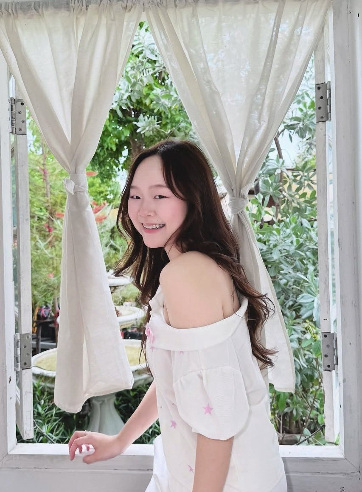

# ทุกคนต้องสร้าง Branch ของตัวเอง

วิธีสร้าง:

1. สร้างและย้ายไปยัง branch ใหม่:

```bash
git switch -c <branch-name>
```

2. ตรวจสอบรายชื่อ branch:

```bash
git branch --list
```

หมายเหตุ: ใช้ชื่อ branch ชื่อของตัวเอง เช่น Chidpong
# TODO 
<รูปภาพ>
<ลิงก์ social media>
.
# ข้อมูลพื้นฐาน


- **ชื่อ** : นางสาวพิมพ์พิกา ชาติราษี
- **IG** : [qimbuike]( https://www.instagram.com/qimbuike?igsh=bzhrZDZmYTYwN2Np&utm_source=qr)
- **ชื่อเล่น** : ต้นหลิว
- **อายุ** : 19
- **อนาคตอยากทำอะไร** : Frond-end dev เพราะว่าชอบทำเกี่ยวกับออกแบบหน้าบ้านของเว็บ แล้วก็ชอบพวก Ux/Ui ร่วมด้วย
- **ชอบฟังเพลงแนวอะไร เพราะอะไรจึงชอบฟังเพลงแนวนี้** : แนวเพื่อชีวิต เช่น คาราบาว เสกโลโซ เพราะว่ามันทัชใจ แล้วก็เบื่อแนวเพลงสากลแล้ว เมื่อก่อนชอบ The weekend,Joji แต่ตอนนี้เปลี่ยนมาเป็นคาราบาว
- **สถานที่ที่ชอบที่สุด มีความทรงจำหรือเหตุการณ์อะไรที่ทำให้ชอบสถานที่นี้** : ชอบบ้านตัวเองที่ต่างจังหวัด(สุโขทัย) เพราะคิดถึงบรรยากาศชนบท คิดถึงคุณยาย คุณตา โตที่นั่น มีความทรงจำเยอะ
- **งานอดิเรกที่ชอบทำ อะไรที่ทำให้คุณสนใจงานอดิเรกนี้** : ติดสติ๊กเกอร์ เพราะเวลาว่างๆเหงาๆ หรือทำอะไรเครียดๆมา นั่งติดสติ๊กเกอร์น่ารักๆกับของที่เราใช่ทุกวัน ความเครียดนั้นก็หายไป
- **ระหว่างธรรมชาติ กับ ในเมืองชอบที่ไหนมากกว่า มีประสบการณ์อะไรที่ทำให้คุณรู้สึกว่าสถานที่แบบนั้นเหมาะกับคุณ** : ชอบธรรมชาติมากกว่า เพราะว่าเคยไปต่างจังหวัดหลายๆที่มา รู้สึกว่ามันสงบ เป็นคนชอบต้นไม้อยู่แล้วด้วย เห็นต้นไม้ภูเขาแม่น้ำลำธารแล้วมันสบายใจ
- **นอกจากเรียนมีทำงานพิเศษอะไร ไหมหรือหารายได้ระหว่างเรียน     อะไรเป็นเหตุผลที่ทำให้คุณเลือกทำงานหรือหารายได้ระหว่างเรียน** : มีทำงานพิเศษด้วย ที่ทำตอนนี้ก็มีเปิดร้านรับทำการบ้าน แต่เราเป็นคนกลาง คุยระหว่างลูกค้า กับคนทำ แล้วก็ขายอาหารผ่าน lineman ที่ทำเพราะรู้สึกมันว่างเกินไป เวลาที่เสียไป ได้เงินมาก็คงดี แล้วก็อยากซื้อของที่อยากได้ด้วยเงินตัวเอง คือมันสามารถซื้อได้เลยโดยไม่ต้องขอพ่อแม่ แล้วก็ภูมิใจด้วย

## ผู้สัมภาษณ์ 
- นางสาวธวัลรัตน์ สิทธิบวรสกุล
- **รหัสนักสึกษา**: 69130500024